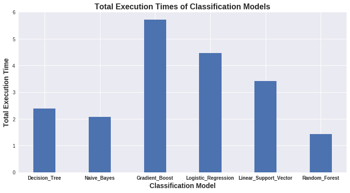
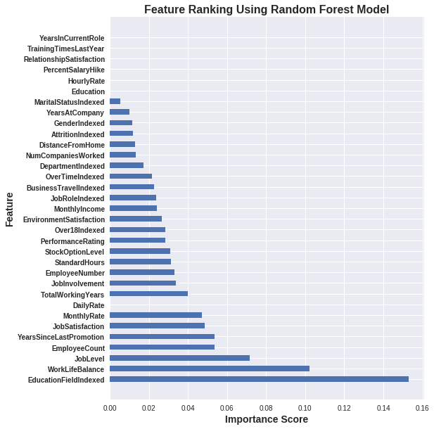
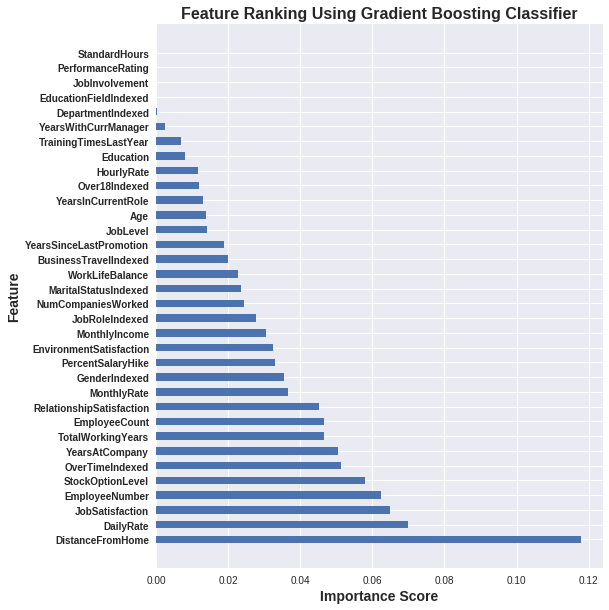
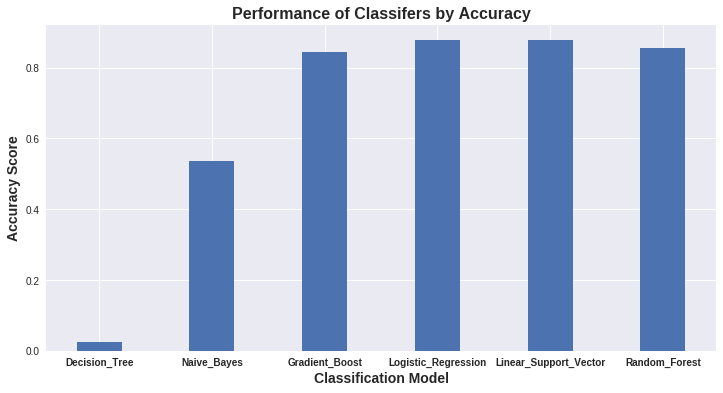

# Big-Data-Project

## Technologies Used

- Python
- Jupyter Notebook
- Scala
- Spark

## Introduction

Welcome to the Big-Data-Project repository! 🚀 In this groundbreaking project, we dive into the realm of Big Data to tackle the perplexing challenge of predicting employee attrition. Our mission is to empower organizations with the ability to identify employees who are likely to leave, paving the way for proactive retention strategies and ensuring a happy and motivated workforce.

## Features

🎯 Our Big-Data-Project offers a range of exciting features:

- **Accurate Predictions**: We harness the power of various classification models to achieve precise employee attrition prediction.
- **Performance Evaluation**: Compare the accuracy, confusion matrix, and computation time of different models to identify the most effective solution.
- **Actionable Insights**: Uncover valuable insights into the patterns and factors contributing to employee attrition, enabling organizations to take informed action.
- **Big Data Magic**: Witness the incredible capabilities of cutting-edge Big Data tools and technologies such as Spark and AWS in handling vast amounts of employee data.

## Visualization

Take a sneak peek into project with these captivating visuals:

## Algorithm

This Big-Data-Project leverages a formidable lineup of classification algorithms to predict employee attrition:

- Naive Bayes 🎩
- Decision Tree 🌳
- Logistic Regression 📈
- Gradient Boosting 🚀
- Random Forest 🌿
- Linear Support Vector Classifier 🏋️‍♂️

We put these algorithms to the test, evaluating their performance in accurately predicting employee attrition and empowering organizations with the knowledge to retain their top talent.

## Results

📊 The performance of models was evaluated based on the following metrics:

- **Accuracy**: Gauge the overall correctness of our predictions.
- **Confusion Matrix**: Dive deep into the detailed breakdown of correct and incorrect predictions.
- **Computation Time**: Assess the time taken by each model for training and prediction.

The comprehensive project report presents the results and performance metrics of each model, shedding light on their effectiveness in predicting employee attrition.

## Conclusion

This Big-Data-Project takes a giant leap towards revolutionizing the way organizations approach employee attrition. Armed with powerful models, actionable insights, and the prowess of Big Data technologies, we equip organizations with the tools they need to proactively address attrition challenges.

